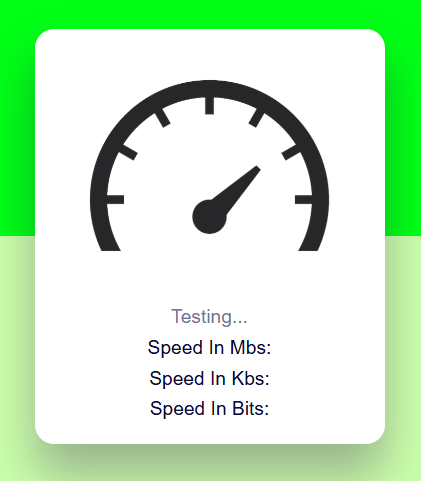

NYG Speed Test

A simple and responsive Internet Speed Test built with pure web technologies.
This project measures connection speed and displays results in multiple units for better understanding.

📸 Preview

</img>

✨ Features

- 🚀 Real-time internet speed testing
- 📊 Displays speed in Mbps, Kbps, and Bits
- 🎯 Clean and minimal UI design
- ⚡ Fast and lightweight (no frameworks)
- 📱 Responsive layout for different screen sizes
- 🧠 Simple and easy-to-understand logic
-💻 Fully client-side implementation

🛠️ Built With

Languages & Technologies

![HTML5]
![CSS3]
![JavaScript]

📁 Project Structure

NYG-SpeedTest/
├── index.html      → Page structure
├── style.css       → Visual styling
├── script.js       → Logic and speed calculation
└── README.md       → Project documentation

👤 Author

Yuri — @NyG007